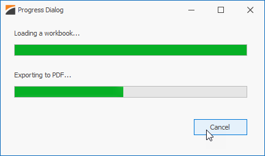

<!-- default badges list -->

<!-- default badges end -->
<!-- default file list -->
*Files to look at*:

* [Form1.cs](./CS/WorkbookProgressSample/Form1.cs) (VB: [Form1.vb](./VB/WorkbookProgressSample/Form1.vb))

<!-- default file list end -->

# Spreadsheet Document API - Indicate Progress of Workbook Operations

This example demonstrates how to create a simple progress dialog that indicates the progress of load and PDF export operations. 

The [Workbook.LoadDocumentAsync](https://docs.devexpress.com/OfficeFileAPI/DevExpress.Spreadsheet.Workbook.LoadDocumentAsync.overloads) and [Workbook.ExportToPdfAsync](https://docs.devexpress.com/OfficeFileAPI/DevExpress.Spreadsheet.Workbook.ExportToPdfAsync.overloads) methods accept a [Progress&lt;T&gt;](https://docs.microsoft.com/en-US/dotnet/api/system.progress-1) instance as a parameter to report progress information. Pass a [CancellationToken](https://docs.microsoft.com/en-US/dotnet/api/system.threading.cancellationtoken) object to these methods to cancel operations when a user clicks **Cancel** or closes the form.
